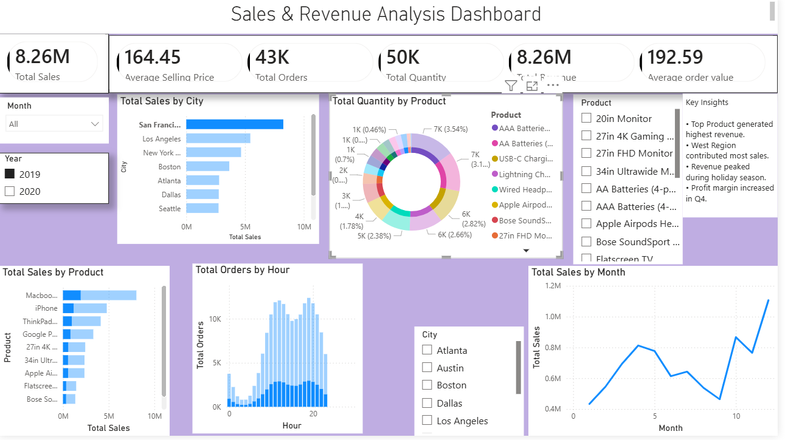

# Sales-Revenue-Analysis
Performed Operations and visuals for the Kaggle dataset of Sales Data

---
<h1>📊 Sales & Revenue Analysis Dashboard | Power BI   </h1>

Developed an interactive Power BI dashboard to analyze sales and revenue data, helping users track business performance and generate actionable insights through visual analytics. 

---

<h3>Key Features-</h3> 
•Imported data from Excel/CSV sources 
•Created KPI cards for Total Sales, Total Profit, Total Orders, Total Quantity, and Average Order Value 
•Visualized revenue trends and top-performing products 
•Built interactive charts, filters, and slicers for dynamic analysis 
•Generated business insights from sales and profit data 
•Data Transformation 

---
<h3>Performed data cleaning and transformation using Power Query: </h3>

•Removed duplicate records 
•Handled missing values 
•Changed data types 
•Created Month and Year columns 
•Prepared data for reporting and analysis 
•DAX Measures Used 
•SUM() 
•SUMX() 
•DISTINCTCOUNT() 
•DIVIDE() 
•Visualizations 
•KPI Cards 
•Revenue Trend Line Chart 
•Top Products Bar Chart 
•Sales by Category Donut Chart 
•Profit by Region Chart 
•Interactive Slicers and Filters 

---

<h3>Skills Demonstrated</h3> 

•Power BI Dashboard Development 
•Data Visualization 
•KPI Tracking 
•Business Insight Generation 
•Data Cleaning & Transformation 
•DAX Calculations 
•Interactive Reporting 
•Expected Outcome 

Learned data visualization, KPI tracking, dashboard design, and business insight generation using Power BI and Power Query.

## Dashboard Preview 

